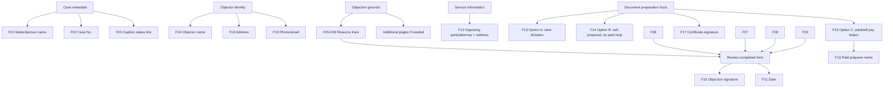

# Probate Objections OCR And Field Dependency Map

Source PDF: [/home/barberb/HACC/evidence/paper documents/Probate Objections.pdf](/home/barberb/HACC/evidence/paper documents/Probate Objections.pdf)

## Extraction Result

- PDF type: scanned image, created by Simple Scan.
- Pages: 1.
- Embedded text: none detected by `pdftotext`.
- Fillable AcroForm fields: none detected by `pypdf`.
- OCR output: [probate_objections.txt](/home/barberb/HACC/workspace/probate_objections_ocr_2026-04-27/probate_objections.txt).
- Annotated field map: [probate_objections_field_map_annotated.pdf](/home/barberb/HACC/workspace/probate_objections_ocr_2026-04-27/probate_objections_field_map_annotated.pdf); [PNG](/home/barberb/HACC/workspace/probate_objections_ocr_2026-04-27/probate_objections_field_map_annotated.png).
- Machine-readable field inventory: [probate_objections_field_inventory.json](/home/barberb/HACC/workspace/probate_objections_ocr_2026-04-27/probate_objections_field_inventory.json).
- Dependency graph: [Mermaid](/home/barberb/HACC/workspace/probate_objections_ocr_2026-04-27/probate_objections_dependency_graph.mmd); [DOT](/home/barberb/HACC/workspace/probate_objections_ocr_2026-04-27/probate_objections_dependency_graph.dot).

## Located Fields

| ID | Field | Dependency | Recommended / note | PDF placement approx |
|---|---|---|---|---|
| F01 | Caption: matter/person name | `case.person_name` | Jane Kay Cortez | x=168.0, line/top y~697.2, w=130.8 pt |
| F02 | Case number | `case.case_number` | 26PR00641 | x=398.4, line/top y~697.2, w=144.0 pt |
| F03 | Caption second line / status | `case.person_role` | Respondent / Protected Person | x=50.9, line/top y~655.2, w=244.3 pt |
| F04 | Objector name | `objector.name` | Benjamin Jay Barber | x=63.4, line/top y~617.3, w=256.6 pt |
| F05 | Reasons line 1 | `objection.reasons.summary_or_first_line` | Short objection summary or first sentence. | x=50.9, line/top y~595.0, w=483.6 pt |
| F06 | Reasons line 2 | `objection.reasons.line_2` | Continue concise reasons; attach additional pages for full motion. | x=50.9, line/top y~569.3, w=483.6 pt |
| F07 | Reasons line 3 | `objection.reasons.line_3` | Continue concise reasons. | x=50.9, line/top y~543.8, w=483.6 pt |
| F08 | Reasons line 4 | `objection.reasons.line_4` | Continue concise reasons. | x=50.9, line/top y~517.9, w=483.6 pt |
| F09 | Reasons line 5 | `objection.reasons.line_5` | Use “See attached motion/memorandum” if relying on attachment. | x=50.9, line/top y~492.5, w=483.6 pt |
| F10 | Objector signature for objection | `objector.signature_after_review` | Manual signature required. | x=343.0, line/top y~411.1, w=206.4 pt |
| F11 | Date signed | `filing.signature_date` | Date signed/filed. | x=343.0, line/top y~386.4, w=193.9 pt |
| F12 | Service recipient / attorney and address | `service.recipient_name_and_last_known_address` | Opposing party or attorney name/address. | x=54.2, line/top y~330.0, w=356.4 pt |
| F13 | Certificate preparation option A checkbox | `document_preparation.option_A_clerk_dictation` | Check only if clerk prepared from oral dictation. | x=74.2, line/top y~180.0, w=14.4 pt |
| F14 | Certificate preparation option B checkbox | `document_preparation.option_B_self_without_paid_assistance` | Likely check this if self-prepared without paid assistance. | x=74.2, line/top y~153.6, w=14.4 pt |
| F15 | Certificate preparation option C checkbox | `document_preparation.option_C_paid_assistance` | Check only if paid/will pay someone. | x=74.2, line/top y~128.4, w=14.4 pt |
| F16 | Paid preparer name | `document_preparation.paid_preparer_name_if_C` | Required only if option C is checked. | x=233.8, line/top y~144.5, w=194.4 pt |
| F17 | Objector signature for certificate | `objector.signature_after_certificate_review` | Manual signature required. | x=350.2, line/top y~108.2, w=199.9 pt |
| F18 | Objector address | `objector.mailing_address` | 10043 SE 32nd Ave, Milwaukie, OR 97222 | x=161.8, line/top y~79.9, w=388.8 pt |
| F19 | Objector phone number and email | `objector.phone_email` | 971-270-0855; starworks5@gmail.com | x=295.0, line/top y~56.4, w=256.3 pt |

## Dependency Graph

## Practical Fill Order

1. Fill case metadata: `F01`, `F02`, `F03`.
2. Fill objector identity: `F04`, then contact fields `F18` and `F19`.
3. Decide whether this one-page objection is only a cover sheet. If the reasons will not fit in `F05-F09`, write a short summary in the form and attach the full motion/memorandum as additional pages.
4. Fill service information in `F12` using the opposing party or counsel of record and last-known address/service address.
5. Select the document-preparation certificate option. If self-prepared without paid assistance, use option B (`F14`). If paid assistance was used, option C (`F15`) also requires the preparer name in `F16`.
6. Sign/date the objection line (`F10`, `F11`) and sign the document-preparation certificate (`F17`).

## OCR Caveat

Because the PDF is a scan and not a fillable form, the coordinates are placement targets for overlaying text or for manual typing/printing. They are not PDF form-field names.
